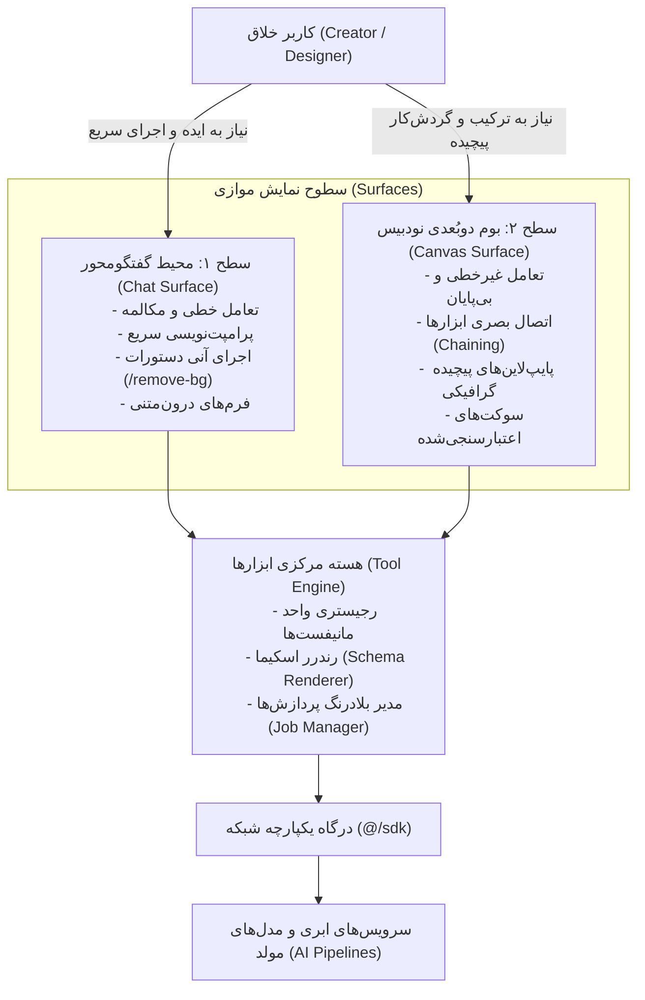
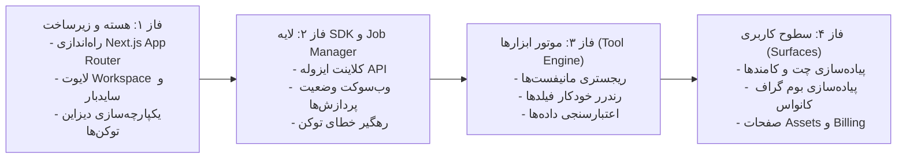

# پروپوزال جامع توسعه محیط کاربری استودیو خلاقیت (Lemmo Workspace App)

> **سند پیشنهادی معماری و چشم‌انداز فنی و تجاری برنامه کاربردی لیمو**  
> **نسخه:** ۱.۰.۰ — شهریور ۱۴۰۵ (سپتامبر ۲۰۲۶)  
> **دامنه پروژه:** هسته نرم‌افزار کاربردی (`/app`) — جدا از پروژه لندینگ و مستندات  

---

## ۱. مقدمه اجرایی (Executive Summary)

پروژه **`app`**، هسته مرکزی و محصول اصلی اکوسیستم **Lemmo** است. بر خلاف پروژه `landing` که ویترین بازاریابی و جذب کاربر است و پروژه `docs` که مخزن دانش مهندسی به شمار می‌رود، `app` همان **استودیوی خلاقیت و فضای کار تعاملی (Workspace)** است که کاربران و طراحان ساعت‌ها در آن به خلق دارایی‌های بصری، ویدیویی و متنی با استفاده از هوش مصنوعی می‌پردازند.

رسالت بنیادین این اپلیکیشن:
> **گذار از چت‌بات‌های تک‌بعدی سنتی به سمت یک استودیوی بصری هیبریدی و چندوجهی.**  
> کاربر نباید میان ابزارهای مختلف تولید تصویر، ادیت ویدیو، حذف پس‌زمینه و پرامپت‌نویسی متنی سردرگم شود؛ بلکه تمامی این زنجیره در دو رابط مکمل (چت محاوره‌ای + کانواس بی‌پایان گرافی) با یک موتور ابزار متمرکز در اختیار او قرار می‌گیرد.

---

## ۲. درک عمیق از دوگانگی سطوح تعاملی (The Dual-Surface Paradigm)

نوآوری ساختاری Lemmo Workspace در این اصل نهفته است: **یک مغز متفکر، دو سطح نمایش.**



### ۱. سطح چت (Chat Surface)
- برای طراحانی است که می‌خواهند بدون درگیر شدن با نودها، سریعاً با دستورات متنی نظیر `/upscale` یا `/remove-bg` روی یک عکس تغییرات اعمال کنند.
- پارسر کامند، فرم‌های ورودی را به طور خودکار از روی مانیفست ابزار می‌سازد و درون حباب‌های چت قرار می‌دهد.

### ۲. سطح کانواس (Canvas Surface)
- برای گردش‌کارهای حرفه‌ای (مشابه ComfyUI و پلتفرم‌های ساخت پایپ‌لاین هوش مصنوعی) که خروجی یک ابزار (مانند Text-to-Image) باید به ورودی ابزار دیگر (مانند Inpainting یا Upscaler) متصل شود.
- نودها به صورت خودکار از همان مانیفست ابزار ساخته شده و سوکت‌های ورودی و خروجی تایپ‌شده دارند (`image` فقط به `image` و `text` فقط به `text` وصل می‌شود).

---

## ۳. معماری فنی و مهندسی لایه‌بندی‌شده (Technical Architecture)

پروژه بر پایه **Next.js (App Router)** با ساختار ماژولار و تفکیک سخت‌گیرانه دامنه‌ها پیاده‌سازی می‌شود. جهت وابستگی در این پروژه همیشه یک‌طرفه و تغییرناپذیر است:
$$\text{app} \longrightarrow \text{modules} \longrightarrow \text{tool-engine} \longrightarrow \text{sdk} \longrightarrow \text{backend}$$

```
src/
├── app/                                  # فقط لایه روتینگ و لایوت (Next.js App Router)
│   ├── (workspace)/                      # پوسته اصلی استودیو (نیاز به لاگین)
│   │   ├── layout.tsx                    # سایدبار تعاملی، نوار هدر و پایش سراسری Job
│   │   ├── chat/[[...threadId]]/         # استودیوی چت خطی
│   │   ├── canvas/[[...boardId]]/        # بوم نامحدود دوبُعدی
│   │   ├── gallery/                      # ویترین عمومی و الگوهای پرامپت
│   │   ├── assets/                       # خروجی‌ها و فایل‌های شخصی کاربر
│   │   └── settings/billing/             # مدیریت پلن و خرید بسته‌های توکن
│   └── (auth)/                           # صفحات ورود و ثبت‌نام
│
├── modules/                              # منطق دامنه (Domain Logic) — کاملاً ماژولار و تست‌پذیر
│   ├── tool-engine/                      # هسته پلاگین ابزارها (منبع حقیقت چت و کانواس)
│   │   ├── registry/                     # ثبت، جستجو و کش Manifestها
│   │   ├── schema-renderer/              # نگاشت خودکار نوع داده‌ها به کامپوننت‌های فرم و نود
│   │   ├── job-manager/                  # وضعیت بلادرنگ پردازش‌های هوش مصنوعی (Job Store)
│   │   └── plugin-loader/                # بستر آینده برای پلاگین‌های کدنویسی‌شده ثالث
│   ├── chat/                             # ماژول مستقل چت (کامپوننت‌ها، پارسر کامند، هوک‌ها)
│   ├── canvas/                           # ماژول مستقل کانواس (بورد گراف، نودها، قوانین اتصالات)
│   ├── gallery/                          # ماژول کاوش در دارایی‌های عمومی
│   ├── assets/                           # ماژول گالری فایل‌ها با گوش دادن به خروجی ابزارها
│   └── billing/                          # ماژول محاسبه توکن و نمایش بسته‌ها
│
├── sdk/                                   # تنها دروازه ارتباط با سرور و APIها
│   ├── client.ts                          # پیکربندی پایه و تزریق خودکار توکن کاربر
│   ├── generated/                         # کدهای تایپ‌شده اتوماتیک از OpenAPI/tRPC
│   ├── tools.ts                           # فراخوانی متدهای پردازشی ابزارها
│   └── interceptors/                      # رهگیر خطای اتمام توکن (ریدایرکت خودکار به پلن‌ها)
│
├── shared/                                # لایه بدون دامنه (Pure UI & Helpers)
│   ├── ui/                                # کامپوننت‌های اتمیک دیزاین سیستم (Button, Modal, Input, ...)
│   ├── hooks/                             # هوک‌های کمکی (useMediaQuery, useDebounce, ...)
│   └── types/                             # تایپ‌های عمومی پروژه
│
└── stores/                                # وضعیت‌های کلاینتی سراسری (سایدبار، تم و ترجیحات کاربر)
```

---

## ۴. سه ستون کلیدی در حل چالش‌های محصولی

### ستون اول: سیستم ابزار مانیفست‌محور (Schema-Driven Tool System)
- **چالش:** هوش مصنوعی روزانه پیشرفت می‌کند؛ هر هفته ابزارهای جدیدی (مانند تبدیل عکس به مدل سه‌بعدی یا مدل‌های تبدیل صوت به تصویر) به پلتفرم اضافه می‌شوند. اگر برای هر ابزار نیاز به طراحی صفحه، فرم و دیپلوی فرانت‌اند باشد، مقیاس‌پذیری از بین می‌رود.
- **راه‌حل لیمو:** هر ابزار یک فایل مانیفست JSON است. افزودن ابزار جدید = ارسال یک مانیفست از سمت سرور به رجیستری فرانت‌اند. فرم‌های ورودی در چت و گره‌های تعاملی در کانواس بدون هیچ تغییر کدی در فرانت‌اند فوراً متولد می‌شوند.

```json
{
  "id": "flux-image-gen",
  "command": "/flux",
  "displayName": "تولید تصویر با Flux",
  "surfaces": ["chat", "canvas"],
  "renderer": "schema",
  "inputs": [
    { "name": "prompt", "type": "string", "label": "توصیف متنی", "required": true },
    { "name": "aspect_ratio", "type": "select", "options": ["1:1", "16:9", "9:16"], "default": "1:1" },
    { "name": "steps", "type": "slider", "min": 20, "max": 50, "default": 28 }
  ],
  "outputs": [
    { "name": "generated_image", "type": "image" }
  ],
  "endpoint": "tools.fluxGenerate"
}
```

### ستون دوم: چرخه پردازش ناهمگام هوش مصنوعی (Global AI Job Manager)
- **چالش:** مدل‌های هوش مصنوعی زایشی به دلیل پیچیدگی پردازشی، خروجی بلادرنگ میلی‌ثانیه‌ای ندارند؛ تولید یک تصویر ممکن است ۵ ثانیه و تولید یک ویدیو ۲ دقیقه زمان ببرد.
- **راه‌حل لیمو:**
  1. درخواست اجرای ابزار فوراً یک `jobId` بازمی‌گرداند.
  2. وضعیت درخواست وارد چرخه $\text{Pending} \rightarrow \text{Processing} \rightarrow \text{Done} \mid \text{Error}$ در استور متمرکز Zustand می‌شود.
  3. اتصال WebSocket / SSE وضعیت را ثانیه‌به‌ثانیه در کل برنامه مخابره می‌کند: نوار پیشرفت در هدر بالا می‌درخشد، در کانواس لودینگ روی همان نود نمایش می‌یابد، و در چت وضعیت درصد پردازش درج می‌شود.
  4. به محض اتمام پردازش، نتیجه به طور خودکار به آرشیو `assets/` افزوده می‌شود بدون آنکه بخش‌های برنامه به یکدیگر وابسته باشند.

### ستون سوم: تفکیک سیستم مالی و مصرف توکن (SDK Token Interceptor)
- **چالش:** هیچ کامپوننت فرانت‌اندی یا دکمه‌ای نباید منطق پیچیده اعتبارسنجی مالی یا قوانین پرداخت را در خود جای دهد.
- **راه‌حل لیمو:** لایه `@/sdk` خطای `INSUFFICIENT_TOKENS` را در لایه رهگیر کلاینت دریافت کرده و رویداد هدایت کاربر به `/settings/billing` را فعال می‌کند. این ایزوله‌سازی باعث حفظ پاکیزگی معماری می‌شود.

---

## ۵. نقشه راه و فازبندی پیاده‌سازی (Execution Roadmap)



| فاز | تمرکز کلیدی | خروجی ملموس |
| :--- | :--- | :--- |
| **۱. پی‌ریزی و شل استودیو** | پیکربندی Next.js، احراز هویت و لایوت‌های اختصاصی | رابط کاربری کلی فضای کار با قابلیت جابجایی بین چت و کانواس |
| **۲. ارتباطات و پایش وضعیت** | ساخت پکیج `@/sdk` و پایپ‌لاین اتصال بلادرنگ WebSocket/SSE | ارسال درخواست‌های شبیه‌سازی‌شده و به‌روزرسانی نوار وضعیت Job |
| **۳. هسته پلاگین ابزارها** | پیاده‌سازی `tool-engine` و کامپوننت‌های رندرر خودکار فیلدها | نمایش پویا و خودکار فرم‌های ورودی ابزارها صرفاً از روی فایل JSON |
| **۴. پیاده‌سازی استودیوی چت** | ساخت ماژول چت، پیشنهاددهنده دستورات (`/`) و کامپوننت‌های پیام | امکان اجرای دستورات هوش مصنوعی از طریق مکالمه |
| **۵. پیاده‌سازی استودیوی کانواس** | ادغام بورد دوبُعدی، نودهای مانیفست‌محور و قانون اتصال سیم‌ها | ایجاد پایپ‌لاین چندمرحله‌ای بصری برای تولید و ویرایش محتوا |
| **۶. ماژول‌های تکمیلی و تحویل نهایی** | اتصال کتابخانه دارایی‌ها (`assets`) و مدیریت اعتبارات (`billing`) | فضای کاری کامل، یکپارچه، تست‌شده و آماده استفاده کاربران |

---

## ۶. جمع‌بندی و نتیجه‌گیری

پروژه `app` یک اپلیکیشن معمولی وب نیست؛ این محصول **موتور محرک و عامل تمایز رقابتی پلتفرم Lemmo** در دنیای ابزارهای هوش مصنوعی است. تفکیک دقیق لایه‌ها، بهره‌گیری از سیستم ابزار داده‌محور (Schema-driven)، پایش ناهمگام وضعیت پردازش‌ها و ارائه دو سطح تعامل چت و کانواس، محصولی را به ارمغان می‌آورد که در برابر هرگونه رشد سریع مدل‌های هوش مصنوعی و نیازهای بصری کاربران کاملاً پایدار، مقیاس‌پذیر و ماندگار است.
