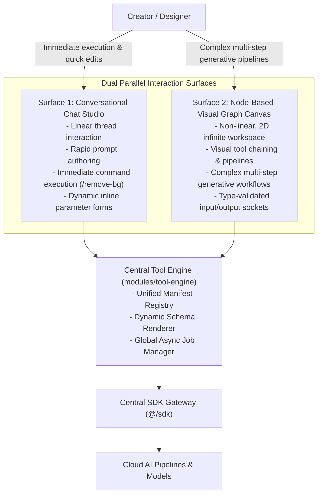

# Lemmo Workspace Studio Proposal: Product Vision & System Architecture

> **Architectural, Technical, and Product Proposal for the Core Application (`/app`)**  
> **Version:** 1.0.0 — September 2026  
> **Scope:** Core Studio Workspace Application — Decoupled from Landing and Docs repositories  

---

## 1. Executive Summary

The **`app`** project is the vital operational core of the **Lemmo** creative ecosystem. Unlike `landing` (the public-facing marketing window) or `docs` (the single source of technical truth), `app` is the actual **creative studio and generative AI workspace** where creators, designers, and teams interactively produce visual, video, and multimedia assets.

The core mission of the application:
> **Transitioning from conventional, single-prompt conversational bots into a unified, multimodal visual creative studio.**  
> Users should never be fragmented across disjointed tools for image generation, inpainting, background removal, or upscaling. Instead, the entire generative lifecycle is orchestrated across two complementary surfaces (linear chat + infinite visual graph canvas), powered by a single, centralized tool engine.

---

## 2. The Dual-Surface Paradigm

The foundational architectural innovation of the Lemmo Workspace lies in the principle: **One Brain, Two Surfaces.**



### 1. Chat Surface (`/chat`)
- Designed for creators seeking rapid, conversational edits without configuring node graphs.
- Direct slash-commands (e.g. `/flux`, `/upscale`, `/remove-bg`) dynamically expand into inline parameter forms directly inside chat bubbles.

### 2. Canvas Surface (`/canvas`)
- Tailored for advanced, multi-stage pipelines (inspired by ComfyUI and Figma), where outputs of one model (e.g., text-to-image) feed into another (e.g., inpainting or 4x upscaler).
- Interactive nodes are dynamically generated from tool schemas, enforcing strictly typed socket connections (`image` connects strictly to `image`, `mask` to `mask`).

---

## 3. Layered Technical Architecture

The studio is constructed on **Next.js (App Router)** adhering to a strict, non-negotiable unidirectional dependency hierarchy:
$$\text{app} \longrightarrow \text{modules} \longrightarrow \text{tool-engine} \longrightarrow \text{sdk} \longrightarrow \text{backend}$$

```
src/
├── app/                                  # Route and layout layer only (Next.js App Router)
│   ├── (workspace)/                      # Authenticated workspace studio shell
│   │   ├── layout.tsx                    # Shared studio shell: sidebar, topbar, active job tracker
│   │   ├── chat/[[...threadId]]/         # Linear conversational studio
│   │   ├── canvas/[[...boardId]]/        # Infinite 2D node-graph canvas
│   │   ├── gallery/                      # Community showcase & prompt templates
│   │   ├── assets/                       # User asset library & output archive
│   │   └── settings/billing/             # Token balance, plan tiers & credit packs
│   └── (auth)/                           # Authentication routes (login, register)
│
├── modules/                              # Domain logic modules — independent & isolated
│   ├── tool-engine/                      # The single source of truth for tools
│   │   ├── registry/                     # Manifest loader, registry, caching
│   │   ├── schema-renderer/              # Dynamic UI generation from JSON schemas
│   │   ├── job-manager/                  # Global async AI job state store (Zustand)
│   │   └── plugin-loader/                # Foundation for future sandboxed code plugins
│   ├── chat/                             # Chat domain components, command parser, hooks
│   ├── canvas/                           # Graph board, tool nodes, socket connection rules
│   ├── gallery/                          # Template discovery & remix hooks
│   ├── assets/                           # Asset grid, filtering, job completion listeners
│   └── billing/                          # Plan cards, token balance & checkout hooks
│
├── sdk/                                   # Sole network gateway to backend
│   ├── client.ts                          # Base configuration & token injection
│   ├── types.ts                           # Shared SdkClient interface contract
│   ├── mock/                              # Zero-leakage mock adapter & job simulator
│   ├── live/                              # Live typed HTTP & WebSocket client
│   └── interceptors/                      # Central token exhaustion redirect interceptor
│
├── shared/                                # Domain-agnostic reusable primitives
│   ├── ui/                                # Button, Input, Slider, Modal, Tooltip
│   ├── hooks/                             # useDirection, useMediaQuery, useDebounce
│   └── types/                             # Common global TypeScript definitions
│
└── stores/                                # Global client UI state (sidebar, theme)
```

---

## 4. In-Code Language & Comment Standards (Mandatory)

> 🚨 **MANDATORY ENGINEERING RULE: ENGLISH-ONLY IN CODE, COMMENTS & CAPTIONS**  
> - **All code comments, function docstrings, JSDoc/TSDoc annotations, component captions, variable names, and commit messages MUST be written strictly in clear, professional English.**
> - Non-English comments (such as Persian comments) inside `.ts`, `.tsx`, `.js`, `.css`, or code blocks are **strictly forbidden**.
> - User-facing UI copy supports both Persian and English via the i18n subsystem, but all underlying engineering artifacts, logic documentation, and codebase comments remain 100% English.

---

## 5. Core Architectural Pillars

### Pillar 1: Schema-Driven Tool Engine
- **Challenge:** Generative AI models evolve weekly. Requiring frontend deployments and hardcoded forms for every new model destroys velocity.
- **Solution:** Every AI capability is defined as a standard JSON Tool Manifest. Adding an AI tool requires registering a JSON manifest with zero frontend component code changes. The `schema-renderer` dynamically renders form controls in Chat and node controls in Canvas.

```json
{
  "id": "flux-image-gen",
  "command": "/flux",
  "displayName": "Flux Image Generator",
  "surfaces": ["chat", "canvas"],
  "renderer": "schema",
  "inputs": [
    { "name": "prompt", "type": "string", "label": "Prompt", "required": true },
    { "name": "aspect_ratio", "type": "select", "options": ["1:1", "16:9", "9:16"], "default": "1:1" },
    { "name": "steps", "type": "slider", "min": 20, "max": 50, "default": 28 }
  ],
  "outputs": [
    { "name": "generated_image", "type": "image" }
  ],
  "endpoint": "tools.fluxGenerate"
}
```

### Pillar 2: Global Asynchronous AI Job Manager
- **Challenge:** Generative models take seconds or minutes to generate high-fidelity assets.
- **Solution:**
  1. Triggering a tool immediately yields a `jobId`.
  2. The job enters the lifecycle: $\text{Pending} \longrightarrow \text{Processing} \longrightarrow \text{Done} \mid \text{Error}$.
  3. Real-time updates (WebSocket/SSE) sync across all surfaces: the global topbar displays progress, the canvas node shows live processing state, and chat bubbles show completion percentage.
  4. On completion, the output automatically appears in the user's `assets/` library with zero coupling between Canvas, Chat, and Assets.

### Pillar 3: Single-Switch Zero-Leakage SDK Gateway
- **Challenge:** Components should never be tied to specific backend URLs, nor should they know whether data is coming from mock or live servers.
- **Solution:** Components consume exclusively `import { sdk } from '@/sdk'`. Both the mock adapter and live client implement the identical `SdkClient` contract. Migrating to live backend requires toggling a single environment variable (`NEXT_PUBLIC_API_MODE="live"`) with zero frontend refactoring.
